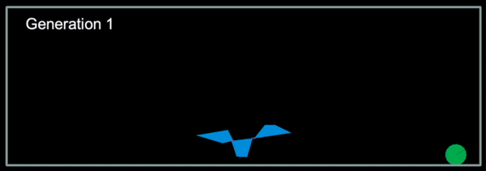

# Genetic algorithm learning to jump over the ball

A quick exercise to recall Genetic Algorithms. Teaching a three-polygon figure to jump over the ball. Recreation of this [video](https://www.youtube.com/watch?v=Gl3EjiVlz_4&t=12s) without using a neural network. The genetic algorithm tries to find a sequence of moves needed to minimize the fitness function which is the overlap between the obstacle and the figure. Physics engine: pymunk, display: pyglet.

<p align="center">

</p>

## Overview

`figure.py` - A geometric shape out of three polygons that moves its left/right polygon up/down

`universe.py` - Static space with 4 walls, obstacle, and a figure

`simulation.py` - Simulates actions of a figure and a moving obsticle (30 fps and 4 actions per second)

`display.py` - Recreates a simulation and displays it in pyglet

`ga.py` - Genetic algorithm. Generates random lists of actions, performs uniform crossover, evaluates and picks elite individuals.


* __Individual__ is represented by its actions (0: no movement, 1 and 2: left polygon up and down, 3 and 4: right polygon up and down). For example: [1, 0, 4, 3, 2, 0, ...] - left poly up, nothing, right poly down, ...

* __Crossover__ each bit is chosen from either parent with a given probability (uniform crossover)

* __Fitness function__ is a sum of overlap and a penalty of making a move

* __Simulation__ takes 8.6 seconds (untill the obsticle hits the left wall) and the figure makes a move every 0.25 seconds

## Run

```bash
pip install requirements.txt
cd genetic_algorithm
python3 main.py
```
